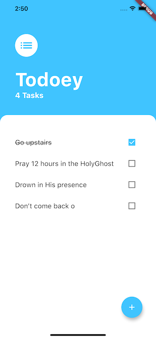

# Todoey ✓

A todolist app to keep track of all your tasks. using provider package to manage the app state.

## Getting Started

Fork the project and run on your device

## Prerequisites

A prior knowledge of git 🙂

## What I learnt

- Understand what is state and why we need to manage it.
- Understand the difference between ephemeral (local) state and app state.
- See the problems with simply relying on setState().
- Learn about the concept of Prop Drilling.
- Examine various popular ways of managing app state for Flutter projects.
- Learn about the List Builder.
- Use the Flutter BottomSheet Widget.
- Learn to lift state up to be able to access it from children widgets.
- Learn about design patterns and why they are useful.
- Understand how the Provider package works and use it to manage app state.

## Screen shots

Home Screen

Add Task Screen

## Acknowledgments

This is a companion project to The App Brewery's Complete App Development Bootcamp, check out the full course at [www.appbrewery.co](https://www.appbrewery.co/)